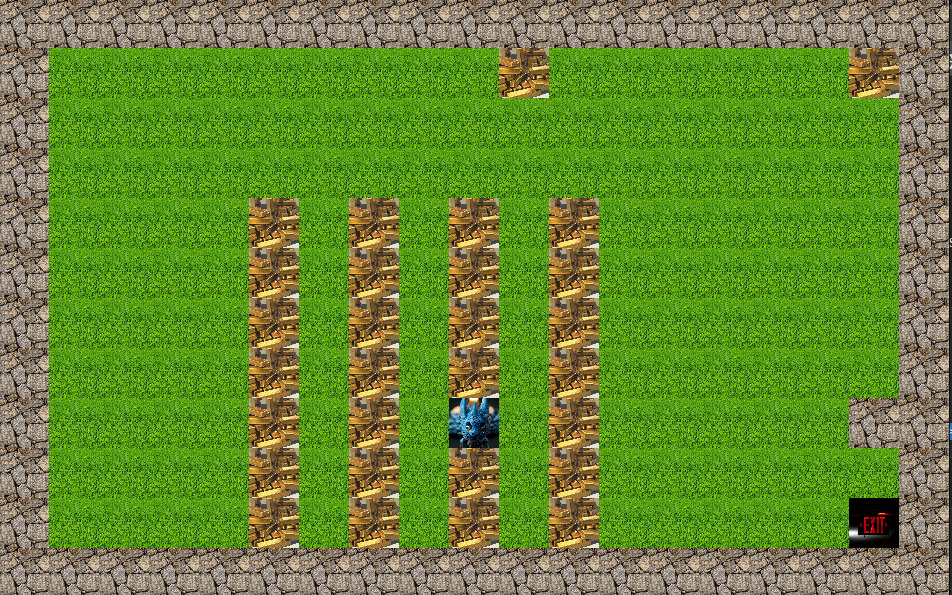

## SoLong - 42

# Description:
So Long is a 2D game project that introduces fundamental game programming concepts using the MiniLibX graphics library. The player controls a character that must collect all items on a map and reach the exit using the shortest path possible. This project focuses on working with textures, sprites, window management, and event handling. The game features a top-down view with tile-based movement, where players navigate through maps defined by .ber files containing walls, collectibles, empty spaces, player starting position, and exit points. 



# Context:
Part of 42 Common Core.

# Main Technologies / Skills Used:

- **Programming Languages:** C
- **Graphics Programming:** Working with the MiniLibX library for window and image creation  
- **2D Game Management:** Managing player position and map grid navigation
- **Event Handling:** Managing keyboard inputs and window events
- **Texture Management:** Loading, displaying, and manipulating sprites and textures
- **Map Parsing:** Reading and validating .ber map files with specific formatting requirements
- **Memory Management:** Proper allocation and cleanup of graphics resources
- **File I/O Operations:** Reading map files and handling file errors
- **Error Handling:** Comprehensive validation of map structure and game states
- **Makefile Management:** Building projects with graphics library dependencies

# Installation and compilation
1. Clone this repository into your project:
```bash
git clone git@github.com:Philippe89fr/42_soLong.git
```
2. Run the following command:
```bash
make
```
3. with bonus:
```bash
make bonus
```
